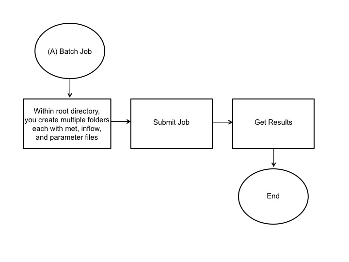

Distributed Computing Made Easy for Lake Ecology Modeling
---------------------------------------------------------
GRAPLEr is an R-based open-source software product of GRAPLE, the [GLEON] Research and [PRAGMA] Lake Expedition.

GRAPLEr brings the power of distributed computing to the fingertips of lake ecology modelers. While it is relatively easy to run one lake model simulation on a personal computer, it is more difficult to execute multiple simulations, which requires additional computing and human resources. To overcome this problem, GRAPLEr, a distributed computing system, integrates and applies overlay virtual network, high-throughput computing, and Web service technologies. GRAPLEr allows submission of hundreds or thousands of General Lake Model (GLM) simulations, runs these lake model simulations efficiently, and retrieves model output.

### Using GRAPLEr

GRAPLEr, available on GitHub, is installed on a personal computer and integrated into the R development environment. It acts as a proxy to translate user commands written in R into Web service calls and arranges data between the client and Web service. A GLM simulation is specified by a set of input files (csv files) and model parameters (nml file). The required input files consist of time-series meteorological and inflow data. An additional outflow csv file can be included. Based on inputs, GRAPLEr either (A) performs a batch job which submits multiple preconfigured simulations as a job or (B1) performs a linear sweep or (B2) random sweep which generates multiple simulation input files, as specified, for submission:

The batch job or option A requires multiple simulation folders with required meteorological, inflow, and parameter files:

The linear or random sweep jobs B require a single set of baseline meteorological, inflow, and parameter files and a job description file (csv file) specifying constant or random distribution offsets to input variables within the meteorological and inflow files:

The job description file specifies the file (met.csv or inflow.csv) to be modified, number of samples or iterations, variables, mathematical operation (add, sub, mul, or div), type of distribution (linear, random, uniform, binomial, or Poisson), and range of values. Next, GRAPLEr configures, queues, and runs jobs and consolidates and prepares results for download. The resulting output at the completion of the model run is a netCDF file containing time-series data of lake variables at varying depths.

### Getting started

You can go through the [project EDDIE] module to test-drive the execution of hundreds of GLM model runs through GRAPLEr

### Contact us

For additional information, contact Renato Figueiredo (renato at acis.ufl.edu), Cayelan Carey (cayelan at vt.edu) or Paul Hanson (pchanson at wisc.edu)

### Acknowledgments

GRAPLEr has been developed as a collaboration between researchers in PRAGMA and GLEON, with support from a supplement the the PRAGMA award (NSF OCI-1234983).

  [project EDDIE]: http://cemast.illinoisstate.edu/data-for-students/modules/lake-modeling.shtml
  [GLEON]: http://www.gleon.org/
  [PRAGMA]: http://www.pragma-grid.net/
