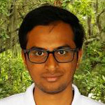

---
{: .clear-both}

{: .profile-img}

### Renato Figueiredo [<i class="fa fa-link"></i>](https://www.acis.ufl.edu/people/renatof)

Professor, ACIS Lab, University of Florida

---
{: .clear-both}

{: .profile-img}

### Cayelan Carey [<i class="fa fa-link"></i>](http://www.carey.biol.vt.edu/)

Assistant Professor, Carey Lab, VirginiaTech University

---
{: .clear-both}

{: .profile-img}

### Paul C. Hanson [<i class="fa fa-link"></i>](http://hanson.limnology.wisc.edu/)

Distinguished Research Professor, UW Center for Limnology, University of Wisconsin-Madison

---
{: .clear-both}

{: .profile-img}

### Kenworth Subratie [<i class="fa fa-link"></i>](https://www.acis.ufl.edu/people/kcratie)

PhD Candidate, ACIS Lab, University of Florida

---
{: .clear-both}

{: .profile-img}

### Saumitra Aditya [<i class="fa fa-link"></i>](https://www.acis.ufl.edu/people/saumitraaditya)

PhD Candidate, ACIS Lab, University of Florida

---
{: .clear-both}

{: .profile-img}

### Jaikrishna Tanjore Sukumar [<i class="fa fa-link"></i>](https://www.acis.ufl.edu/people/jaikrishna)

Alumni, ACIS Lab, University of Florida

---
{: .clear-both}

{: .profile-img}

### Arianna Krinos

Undergraduate Student, Carey Lab, VirginiaTech University

---
{: .clear-both}

{: .profile-img}

### Vahid Daneshmand [<i class="fa fa-link"></i>](https://www.acis.ufl.edu/people/vdaneshmand)

PhD Student, ACIS Lab, University of Florida

---
{: .clear-both}